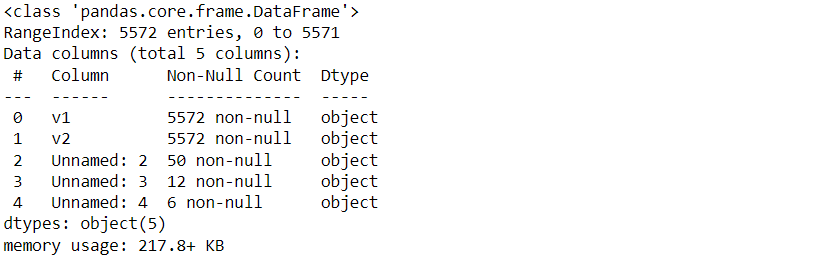
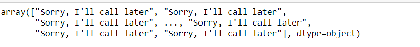

# Implementation-of-SVM-For-Spam-Mail-Detection

## AIM:
To write a program to implement the SVM For Spam Mail Detection.

## Equipments Required:
1. Hardware – PCs
2. Anaconda – Python 3.7 Installation / Jupyter notebook

## Algorithm
step 1.Start

step 2.Import the required packages.

step 3.Import the dataset to operate on.

step 4.Split the dataset.

step 5.Predict the required output.

step 6.Stop.

## Program:
```
/*
Program to implement the SVM For Spam Mail Detection..
Developed by: Santhosh T
RegisterNumber:  212223220100
*/

import pandas as pd
data=pd.read_csv('/content/spam.csv',encoding='Windows-1252')

data.head()

data.info()

data.isnull().sum()

x=data["v1"].values
y=data["v2"].values


from sklearn.model_selection import train_test_split
x_train,x_test,y_train,y_test=train_test_split(x,y,test_size=0.2,random_state=0)

from sklearn.feature_extraction.text import CountVectorizer
cv=CountVectorizer()

x_train=cv.fit_transform(x_train)
x_test=cv.transform(x_test)

from sklearn.svm import SVC
svc=SVC()
svc.fit(x_train,y_train)
y_pred=svc.predict(x_test)
y_pred

from sklearn.metrics import accuracy_score,confusion_matrix,classification_report 
accuracy=metrics.accuracy_score(y_test,y_pred)
accuracy

con=confusion_matrix(y_test,y_pred)
print(con)

cl=classification_report(y_test,y_pred)
print(cl)
```

## Output:
### data.head():

### data.info():

### data.isnull()sum():

### y_predict:

### Accuracy:

### Confusion_matrix:

### Classification_report:


## Result:
Thus the program to implement the SVM For Spam Mail Detection is written and verified using python programming.
